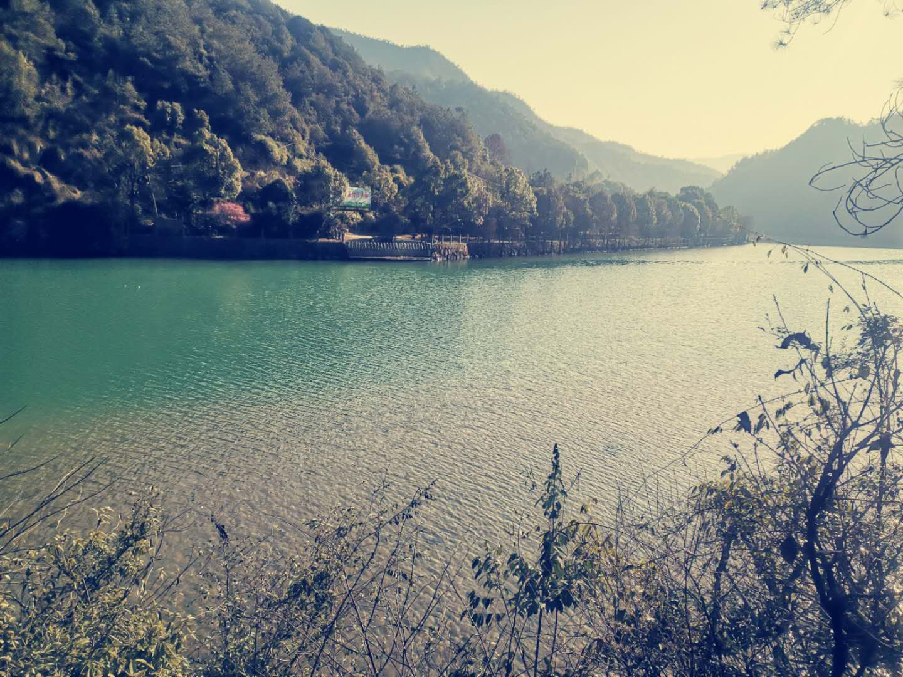

## ❤我的寒假生活❤
### ☆锻炼篇：
#### 乾潭镇的绿道一年四季都非常漂亮，早晚也各有风采

#### 在这样的绿道里运动，不失为一种享受了
#### 可惜疫情爆发，居家隔离，鲜有机会出去
#### 偶尔的keep锻炼和跟随妈妈的瑜伽拉伸，也另有一番趣味
#### 家里人都爱运动，疫情好转过后一家三口就爱出去跑步，减去寒假往上飙升的体重

### ☆学习篇：
#### 过年之前学习开车，准备考驾照
#### 信心满满，预约被取消
#### 年后认真写作业，完成年前没有完成的假期任务
#### 满满的计划，总算没有落空
#### 只可惜数学对我来说实在是太难了一些(ಥ﹏ಥ)
#### 我还是偏爱英语吧，年后的生活每天都被英语“打扰”了
#### 刚开始上网课还有点不知所措
#### 梳理过之后开始踏上“正轨”
   
#### 希望寒假的学习生活没有白费，来年的绩点可以更高一点！

### ☆娱乐篇
#### 寒假娱乐大事件：追剧(*^▽^*)
#### 寒假看完了《锦衣之下》，被任嘉伦圈了
#### 还看过《明星大侦探》作为空余时间的消遣
#### 另外，三人宅在家中无所事事，打牌是个很好的选择
#### 于是，家中三人几乎每天都要花一两个小时“赌上一赌”
#### 是个其乐融融的开心场面٩(๑>◡<๑)۶

#### 寒假已经接近尾声，但生活还在继续
#### 我会在我的个人主页里续写我的生活
#### 希望你们的寒假，也过得充实快乐！

  
